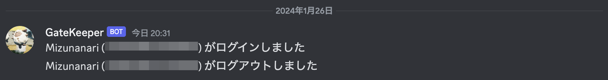

# DiscordGameLoginNotifier

## 概要

PalworldのサーバにRCON接続して一定時間毎にコマンドを使用してログイン情報をポーリングします。プレイヤのログインやログアウトを検知するとDiscordに通知を送信します。



## Setup

PalWorldゲームサーバと同一のサーバで動作させる場合の手順です。

### 1. DiscordでWebHook URLを発行する

「サーバー設定」 > 「アプリ/連携サービス」 > 「ウェブフック」 > 「新しいウェブフック」よりWebフックを作成し、URLをコピーする。

### 2. RCONを設定する

PalWorldのサーバアプリケーションの[設定パラメータ](https://tech.palworldgame.com/optimize-game-balance)で`RCONEnabled`と`RCONPort`を設定し、RCONを有効化します。

| 設定項目    | 設定例 |
| ----------- | ------ |
| RCONEnabled | True   |
| RCONPort    | 25575  |

## Composeで動かす

Dockerを使用してコンテナで動作させます。下記を参考にDockerをインストールしておく必要があります。いくつかインストール方法がありますが、aptなどのパッケージ管理システムを使用してインストールすることをお勧めします。インストール後は、Linux-postinstallを参考にユーザに権限を付与します。

1. https://docs.docker.com/engine/install/
2. https://docs.docker.com/engine/install/linux-postinstall/

### 1. 環境変数の書き換え

`compose.yaml`の環境変数に値を入力します。

```yaml
    environment:
      DGLN_DISCORD_WEBHOOK_URL: https://discord-webhook-url
      DGLN_RCON_ADDRESS: 192.168.1.50
      DGLN_RCON_PORT: 25575
      DGLN_RCON_PASSWORD: adminPassword
      DGLN_LOOP_INTERVAL_SEC: 5
      DGLN_LOG_FILEPATH: player_log.json
```

### 2. 起動

```bash
docker compose up -d
```

### 3. 起動確認

```
docker compose logs
```

RCONが正常に接続されると下記のログが表示されます。

```
connected to rcon
```

## TMUXで動かす

### 1. DiscordGameLoginNotifierを準備

DiscordGameLoginNotifierをサーバにクローンします。

```bash
git clone --depth=1 https://github.com/Mizunanari/DiscordGameLoginNotifier.git
cd DiscordGameLoginNotifier
```

### 2. ".env"ファイルを作成する

example.envを元に、.envファイルを作成します。

```bash
cp example.env .env
```

ファイルの中は下記のようになっています。

```text
DGLN_DISCORD_WEBHOOK_URL=''
DGLN_RCON_ADDRESS='127.0.0.1'
DGLN_RCON_PORT='25575'
DGLN_RCON_PASSWORD=''
DGLN_LOOP_INTERVAL_SEC='5'
DGLN_LOG_FILEPATH='player_log.json'
```

| 変数                     | 説明                                                         |
| ------------------------ | ------------------------------------------------------------ |
| DGLN_DISCORD_WEBHOOK_URL | Discordで発行したWebHookのURLを指定する                      |
| DGLN_RCON_ADDRESS        | RCONのアドレスを指定する                                     |
| DGLN_RCON_PORT           | RCONのポートを指定する                                       |
| DGLN_RCON_PASSWORD       | RCONのAdmin Passwordを指定する                               |
| DGLN_LOOP_INTERVAL_SEC   | RCONから取得するプレイヤ情報のポーリング間隔（秒）を指定する |
| DGLN_LOG_FILEPATH        | 出力するログイン中プレイヤのJSONファイルの名前を指定する     |

### 3. Pythonパッケージのインストール

必要に応じてPythonパッケージをインストールする。

### 4. 仮想環境の作成

```
python3 -m venv venv
```

### 5. シェルの起動

```
source venv/bin/activate
```

### 6. パッケージのインストール

```
pip install -r requirements.txt
```

###  7. 実行

下記の例ではtmux経由で実行し、バックグラウンドでも動作すようにしている。

```
tmux new -s DiscordGameLoginNotifier
python3 ./discord-game-login-notifier/main.py
```

## Serviceに登録する

Unitファイルの例

```ini
[Unit]
Description=Discord Game Login Notifier

[Service]
ExecStart=/home/steam/DiscordGameLoginNotifier/venv/bin/python3 /home/steam/DiscordGameLoginNotifier/discord-game-login-notifier/main.py
ExecStop=/bin/kill -INT ${MAINPID}

[Install]
WantedBy=multi-user.target
```


## 参考

- Discord Web Hook
    - https://discord.com/developers/docs/resources/webhook
    - [Webhooksへの序章](https://support.discord.com/hc/ja/articles/228383668-%E3%82%BF%E3%82%A4%E3%83%88%E3%83%AB-Webhooks%E3%81%B8%E3%81%AE%E5%BA%8F%E7%AB%A0)
- PalWorld
    - https://tech.palworldgame.com/optimize-game-balance
